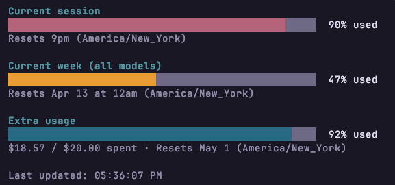

# Claude Quota CLI Tool

A simple wrapper for the cli command `claude /usage`



### Usage
```bash
# activate venv
pip install -r requirements.txt
python claude_quota.py
```

### Sample alias
```hbash
alias cq='cd /repo_dir/claude-quota && .venv/bin/python claude_quota.py'
```
### Notes
- Refreshes every 5m (rate limits at 1m)
- If you run into Claude asking if you trust the folder, just run `claude` first from within that directory and tell it to trust the folder.

